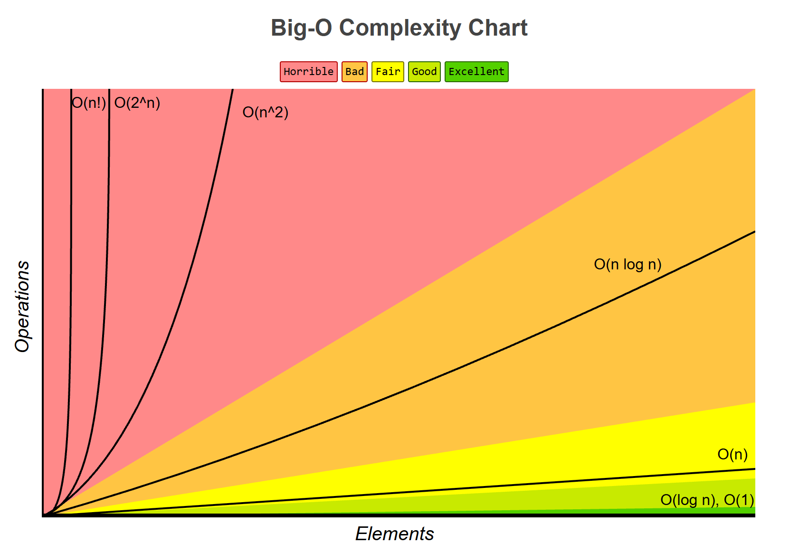

# Сложност на алгоритми

## 1. Какво е алгоритъм?

Алгоритъмът е крайна последователност от точно определени стъпки, чието изпълнение води до решаването на даден проблем или задача.

Разглеждаме два основни критерия за оценка:

- **Коректност:** Показва дали алгоритъмът решава поставената задача правилно и според зададените изисквания.
- **Ефективност:** Определя количеството системни ресурси, необходимо за изпълнението на алгоритъма.

## 2. Сложност на алгоритъм

Сложността на алгоритъм показва как се променят необходимите ресурси при увеличаване на входните данни.

Тя не измерва точното време за изпълнение или използваната памет. Тези стойности зависят от хардуера и средата, в която работи алгоритъмът. Вместо това сложността показва **как се променя натоварването спрямо размера на входа**.

Така различни алгоритми могат да бъдат сравнявани независимо от конкретната машина и условията, при които се изпълняват. Сложността служи като универсален критерий за оценка на тяхната ефективност.

## 3. Видове сложност

### 3.1. Според измервания ресурс

В зависимост от ресурса, който се измерва, се разграничават няколко основни типа сложност:

- **Времева сложност:** Оценява времето за изпълнение на алгоритъма чрез броя направени елементарни операции (напр. сравнения, аритметични действия и присвоявания).
- **Пространствена сложност:** Количеството оперативна памет, необходимо за работата на алгоритъма. Практическият анализ обикновено се фокусира върху допълнителната памет (*auxiliary space*), заделена за междинните променливи и системния стек, извън мястото за самите входни данни.
- **Други типове сложност:** В специфични инженерни контексти се оценяват и алтернативни ресурси. Най-често това са I/O сложност (брой операции за достъп до външна памет) и мрежова сложност (брой заявки или обем трансферирани данни при разпределени системи).

> **Бележка:** Елементарна операция е базово действие, което процесорът изпълнява за фиксирано (константно) време, независимо от обема на входните данни. Тъй като абсолютната скорост зависи от конкретния хардуер, броенето на тези базови стъпки ни позволява да измерваме времевата сложност по универсален и независим от машината начин.

### 3.2. Според начина на измерване

Сложността може да се разглежда и според това как входните данни влияят върху поведението на алгоритъма:

- **Най-лош случай:** Показва максималното количество ресурси, което алгоритъмът може да използва за даден размер на входа. Описва най-неблагоприятния сценарий за изпълнение.
- **Най-добър случай:** Показва минималното количество ресурси, необходимо за даден размер на входа. Описва най-благоприятния сценарий за изпълнение на алгоритъма.
- **Среден случай:** Показва средното количество ресурси, необходимо за входове с даден размер, спрямо определено вероятностно разпределение на данните.
- **Амортизирана сложност:** Измерва средната цена на една операция в рамките на дълга поредица от действия, а не изолирано. Използва се, когато една конкретна стъпка може да е изключително тежка, но тя се случва толкова рядко, че общата изчислителна цена се разпределя равномерно върху всички предхождащи я леки стъпки.

## 4. Как мерим сложност?

### 4.1. Асимптотични нотации

Асимптотичните нотации описват как се променя сложността на алгоритъма при увеличаване на размера на входа. Те задават горна, долна или едновременно горна и долна граница на този растеж:

- **Горна граница $\mathcal{O}$ (Big-O):** Показва, че сложността на алгоритъма не нараства по-бързо от дадена функция. Например $\mathcal{O}(g(n))$ означава, че за достатъчно големи стойности на $n$ сложността е ограничена отгоре от $g(n)$.
- **Долна граница $\Omega$ (Big-Omega):** Показва, че сложността на алгоритъма не нараства по-бавно от дадена функция. Например $\Omega(g(n))$ означава, че за достатъчно големи стойности на $n$ сложността е ограничена отдолу от $g(n)$.
- **Точна граница $\Theta$ (Big-Theta):** Показва, че сложността на алгоритъма е ограничена едновременно отгоре и отдолу от една и съща функция. Например $\Theta(g(n))$ означава, че сложността нараства със същия асимптотичен ред като $g(n)$.

### 4.2. Основни правила за определяне на асимптотична сложност

При практически анализ на код се прилагат следните базови принципи:

- **Игнориране на константи:** Множителите, които не зависят от размера на входа, се пренебрегват, тъй като при достатъчно голямо $n$ тяхното влияние намалява. Така например $\mathcal{O}(2n)$ и $\mathcal{O}(100n)$ се редуцират до $\mathcal{O}(n)$.
- **Правило за най-старшия член:** Ако сложността е представена като сума от няколко члена, запазва се само този с най-бърз темп на нарастване.
- **Последователни операции:** Ако един алгоритъм изпълнява една след друга две независими операции със сложности съответно $\mathcal{O}(f(n))$ и $\mathcal{O}(g(n))$, общата сложност е:

$$\mathcal{O}(f(n) + g(n)) = \max(\mathcal{O}(f(n)), \mathcal{O}(g(n)))$$

- **Вложени операции:** Когато дадено действие се извършва вътре в цикъл, повторенията се умножават по тежестта на самата операция. Вложен цикъл, въртящ се $n$ пъти около друг такъв, води до:

$$\mathcal{O}(f(n) \cdot g(n)) = \mathcal{O}(n \cdot n) = \mathcal{O}(n^2)$$

- **Условни конструкции:** При разклонения (`if-else`) се приема оценка според по-тежкия за изпълнение клон.

## 5. Някои класове сложност

Според темпа си на нарастване (от най-бързи и ефикасни към най-бавни) класовете сложност се подреждат в следната йерархия:

- **Константна сложност $\mathcal{O}(1)$:** За извършване на дадена операция са необходими константен брой стъпки (напр. 1, 5, 10 или друго число) и този брой не зависи от обема на входните данни.
- **Логаритмична сложност $\mathcal{O}(\log n)$:** Ресурсното натоварване нараства изключително бавно, тъй като размерът на обработваните данни намалява с константен фактор на всяка стъпка.
- **Линейна сложност $\mathcal{O}(n)$:** Консумацията на ресурси нараства правопропорционално на размера на входа.
- **Линейно-логаритмична сложност $\mathcal{O}(n \log n)$:** Типична за алгоритми от типа "Разделяй и владей", където проблемът се разделя рекурсивно на $\log n$ нива, на всяко от които се извършва линейна обработка (напр. Merge Sort и Quicksort).
- **Квадратична сложност $\mathcal{O}(n^2)$:** Броят на операциите нараства приблизително като квадрата на размера на входа. Типичен пример са алгоритми с два вложени цикъла, които обработват всички двойки елементи. При по-големи входове броят на операциите нараства бързо.
- **Кубична сложност $\mathcal{O}(n^3)$:** Броят на операциите нараства приблизително като куба на размера на входа. Среща се при алгоритми с три вложени цикъла или при наивното умножение на матрици. Тези алгоритми стават неефективни още при сравнително умерени размери на входа.
- **Експоненциална сложност $\mathcal{O}(2^n)$:** Броят на операциите нараства експоненциално с размера на входа. Характерна е за алгоритми с изчерпателно претърсване и комбинаторно генериране. Дори при сравнително малки входове броят възможни комбинации нараства много бързо.